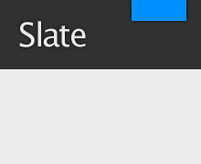

## Help for Marc

### Commands

[//]: # (This may be the most platform independent comment)
[//]: foo bar
[#]: foo bar
[](foo bar)

```md
[//]: # (This may be the most platform independent comment)
[//]: foo bar
[#]: foo bar
[](foo bar)
```

```zsh
# To download
git clone https://github.com/marcpickett1/marcpickett1.github.io
# To run jekyll server
bundle exec jekyll serve
# To submit
git add --all && git commit -m "Foo." && git push -u origin master
# To create new post
cp post.md `./mmdate`post-name.md
```

### The Rest

Text can be **bold**, _italic_, or ~~strikethrough~~.

There should be whitespace between paragraphs.

We recommend including a README, or a file with information about your project.

# [](#header-1)Header 1

This is a normal paragraph following a header. GitHub is a code hosting platform for version
control and collaboration. It lets you and others work together on projects from anywhere.

## [](#header-2)Header 2

> This is a blockquote following a header.
>
> When something is important enough, you do it even if the odds are not in your favor.

### [](#header-3)Header 3

```latex
% LaTeX
\vfill
\newpage
\section{Proof of God's Non-existence} #)))(((

\vfill
\memetar{94}
```

```py
# Python
if True:
  print 'foo'
def bar(bat):
  bing
```

#### [](#header-4)Header 4

*   This is an unordered list following a header.
*   This is an unordered list following a header.
*   This is an unordered list following a header.

##### [](#header-5)Header 5

1.  This is an ordered list following a header.
2.  This is an ordered list following a header.
3.  This is an ordered list following a header.

###### [](#header-6)Header 6

| head1        | head two          | three |
|:-------------|:------------------|:------|
| ok           | good swedish fish | nice  |
| out of stock | good and plenty   | nice  |
| ok           | good `oreos`      | hmm   |
| ok           | good `zoute` drop | yumm  |

### There's a horizontal rule below this.

* * *

### Here is an unordered list:

*   Item foo
*   Item bar
*   Item baz
*   Item zip

### And an ordered list:

1.  Item one
1.  Item two
1.  Item three
1.  Item four

### And a nested list:

- level 1 item
  - level 2 item
  - level 2 item
    - level 3 item
    - level 3 item
- level 1 item
  - level 2 item
  - level 2 item
  - level 2 item
- level 1 item
  - level 2 item
  - level 2 item
- level 1 item

### Small image


### Large image


### Definition lists can be used with HTML syntax.

<dl>
<dt>Name</dt>
<dd>Godzilla</dd>
<dt>Born</dt>
<dd>1952</dd>
<dt>Birthplace</dt>
<dd>Japan</dd>
<dt>Color</dt>
<dd>Green</dd>
</dl>

```
Long, single-line code blocks should not wrap. They should horizontally scroll if they are too long. This line should be long enough to demonstrate this.
```

```
The final element.
```

# The Slate theme

[](https://travis-ci.org/pages-themes/slate) [](https://badge.fury.io/rb/jekyll-theme-slate)

*Slate is a Jekyll theme for GitHub Pages. You can
 [preview the theme to see what it looks like](http://pages-themes.github.io/slate), or even
 [use it today](#usage).*



## Usage

To use the Slate theme:

1. Add the following to your site's `_config.yml`:

    ```yml
    theme: jekyll-theme-slate
    ```

2. Optionally, if you'd like to preview your site on your computer, add the following to your site's `Gemfile`:

    ```ruby
    gem "github-pages", group: :jekyll_plugins
    ```

## Customizing

### Configuration variables

Slate will respect the following variables, if set in your site's `_config.yml`:

```yml
title: [The title of your site]
description: [A short description of your site's purpose]
```

Additionally, you may choose to set the following optional variables:

```yml
show_downloads: ["true" or "false" to indicate whether to provide a download URL]
google_analytics: [Your Google Analytics tracking ID]
```

### Stylesheet

If you'd like to add your own custom styles:

1. Create a file called `/assets/css/style.scss` in your site
2. Add the following content to the top of the file, exactly as shown:
    ```scss
    ---
    ---

    @import "{{ site.theme }}";
    ```
3. Add any custom CSS (or Sass, including imports) you'd like immediately after the `@import` line

### Layouts

If you'd like to change the theme's HTML layout:

1. [Copy the original template](https://github.com/pages-themes/slate/blob/master/_layouts/default.html)
   from the theme's repository<br />(*Pro-tip: click "raw" to make copying easier*)
2. Create a file called `/_layouts/default.html` in your site.
3. Paste the default layout content copied in the first step
4. Customize the layout as you'd like

## Roadmap

See the [open issues](https://github.com/pages-themes/slate/issues)
for a list of proposed features (and known issues).

## Project philosophy

The Slate theme is intended to make it quick and easy for GitHub Pages
users to create their first (or 100th) website. The theme should meet
the vast majority of users' needs out of the box, erring on the side
of simplicity rather than flexibility, and provide users the
opportunity to opt-in to additional complexity if they have specific
needs or wish to further customize their experience (such as adding
custom CSS or modifying the default layout). It should also look
great, but that goes without saying.

## Contributing

Interested in contributing to Slate? We'd love your help. Slate is an
open source project, built one contribution at a time by users like
you. See [the CONTRIBUTING file](CONTRIBUTING.md) for instructions on
how to contribute.

### Previewing the theme locally

If you'd like to preview the theme locally (for example, in the process of proposing a change):

1. Clone down the theme's repository (`git clone https://github.com/pages-themes/slate`)
2. `cd` into the theme's directory
3. Run `script/bootstrap` to install the necessary dependencies
4. Run `bundle exec jekyll serve` to start the preview server
5. Visit [`localhost:4000`](http://localhost:4000) in your browser to preview the theme

### Running tests

The theme contains a minimal test suite, to ensure a site with the
theme would build successfully. To run the tests, simply run
`script/cibuild`. You'll need to run `script/bootstrap` one before the
test script will work.

# Markdown Cheat Sheet

This is intended as a quick reference and showcase. For more complete info, see [John Gruber's original spec](http://daringfireball.net/projects/markdown/) and the [Github-flavored Markdown info page](http://github.github.com/github-flavored-markdown/).

Note that there is also a [Cheatsheet specific to Markdown Here](./Markdown-Here-Cheatsheet) if that's what you're looking for. You can also check out [more Markdown tools](./Other-Markdown-Tools).

##### Table of Contents
[Headers](#headers)
[Emphasis](#emphasis)
[Lists](#lists)
[Links](#links)
[Images](#images)
[Code and Syntax Highlighting](#code)
[Tables](#tables)
[Blockquotes](#blockquotes)
[Inline HTML](#html)
[Horizontal Rule](#hr)
[Line Breaks](#lines)
[Youtube videos](#videos)

<a name="headers"/>
## Headers

```no-highlight
# H1
## H2
### H3
#### H4
##### H5
###### H6

Alternatively, for H1 and H2, an underline-ish style:

Alt-H1
======

Alt-H2
------
```

# H1
## H2
### H3
#### H4
##### H5
###### H6

Alternatively, for H1 and H2, an underline-ish style:

Alt-H1
======

Alt-H2
------

<a name="emphasis"/>
## Emphasis

```no-highlight
Emphasis, aka italics, with *asterisks* or _underscores_.

Strong emphasis, aka bold, with **asterisks** or __underscores__.

Combined emphasis with **asterisks and _underscores_**.

Strikethrough uses two tildes. ~~Scratch this.~~
```

Emphasis, aka italics, with *asterisks* or _underscores_.

Strong emphasis, aka bold, with **asterisks** or __underscores__.

Combined emphasis with **asterisks and _underscores_**.

Strikethrough uses two tildes. ~~Scratch this.~~


<a name="lists"/>
## Lists

(In this example, leading and trailing spaces are shown with with dots: ⋅)

```no-highlight
1. First ordered list item
2. Another item
⋅⋅* Unordered sub-list.
1. Actual numbers don't matter, just that it's a number
⋅⋅1. Ordered sub-list
4. And another item.

⋅⋅⋅You can have properly indented paragraphs within list items. Notice the blank line above, and the leading spaces (at least one, but we'll use three here to also align the raw Markdown).

⋅⋅⋅To have a line break without a paragraph, you will need to use two trailing spaces.⋅⋅
⋅⋅⋅Note that this line is separate, but within the same paragraph.⋅⋅
⋅⋅⋅(This is contrary to the typical GFM line break behaviour, where trailing spaces are not required.)

* Unordered list can use asterisks
- Or minuses
+ Or pluses
```

1. First ordered list item
2. Another item
  * Unordered sub-list.
1. Actual numbers don't matter, just that it's a number
  1. Ordered sub-list
4. And another item.

   You can have properly indented paragraphs within list items. Notice the blank line above, and the leading spaces (at least one, but we'll use three here to also align the raw Markdown).

   To have a line break without a paragraph, you will need to use two trailing spaces.
   Note that this line is separate, but within the same paragraph.
   (This is contrary to the typical GFM line break behaviour, where trailing spaces are not required.)

* Unordered list can use asterisks
- Or minuses
+ Or pluses

<a name="links"/>
## Links

There are two ways to create links.

```no-highlight
[I'm an inline-style link](https://www.google.com)

[I'm an inline-style link with title](https://www.google.com "Google's Homepage")

[I'm a reference-style link][Arbitrary case-insensitive reference text]

[I'm a relative reference to a repository file](../blob/master/LICENSE)

[You can use numbers for reference-style link definitions][1]

Or leave it empty and use the [link text itself].

URLs and URLs in angle brackets will automatically get turned into links.
http://www.example.com or <http://www.example.com> and sometimes
example.com (but not on Github, for example).

Some text to show that the reference links can follow later.

[arbitrary case-insensitive reference text]: https://www.mozilla.org
[1]: http://slashdot.org
[link text itself]: http://www.reddit.com
```

[I'm an inline-style link](https://www.google.com)

[I'm an inline-style link with title](https://www.google.com "Google's Homepage")

[I'm a reference-style link][Arbitrary case-insensitive reference text]

[I'm a relative reference to a repository file](../blob/master/LICENSE)

[You can use numbers for reference-style link definitions][1]

Or leave it empty and use the [link text itself].

URLs and URLs in angle brackets will automatically get turned into links.
http://www.example.com or <http://www.example.com> and sometimes
example.com (but not on Github, for example).

Some text to show that the reference links can follow later.

[arbitrary case-insensitive reference text]: https://www.mozilla.org
[1]: http://slashdot.org
[link text itself]: http://www.reddit.com

<a name="images"/>
## Images

```no-highlight
Here's our logo (hover to see the title text):

Inline-style:


Reference-style:
![alt text][logo]

[logo]: https://github.com/adam-p/markdown-here/raw/master/src/common/images/icon48.png "Logo Title Text 2"
```

Here's our logo (hover to see the title text):

Inline-style:


Reference-style:
![alt text][logo]

[logo]: https://github.com/adam-p/markdown-here/raw/master/src/common/images/icon48.png "Logo Title Text 2"

<a name="code"/>
## Code and Syntax Highlighting

Code blocks are part of the Markdown spec, but syntax highlighting isn't. However, many renderers -- like Github's and *Markdown Here* -- support syntax highlighting. Which languages are supported and how those language names should be written will vary from renderer to renderer. *Markdown Here* supports highlighting for dozens of languages (and not-really-languages, like diffs and HTTP headers); to see the complete list, and how to write the language names, see the [highlight.js demo page](http://softwaremaniacs.org/media/soft/highlight/test.html).

```no-highlight
Inline `code` has `back-ticks around` it.
```

Inline `code` has `back-ticks around` it.

Blocks of code are either fenced by lines with three back-ticks <code>```</code>, or are indented with four spaces. I recommend only using the fenced code blocks -- they're easier and only they support syntax highlighting.

<pre lang="no-highlight"><code>```javascript
var s = "JavaScript syntax highlighting";
alert(s);
```

```python
s = "Python syntax highlighting"
print s
```

```
No language indicated, so no syntax highlighting.
But let's throw in a &lt;b&gt;tag&lt;/b&gt;.
```
</code></pre>


```javascript
var s = "JavaScript syntax highlighting";
alert(s);
```

```python
s = "Python syntax highlighting"
print s
```

```
No language indicated, so no syntax highlighting in Markdown Here (varies on Github).
But let's throw in a <b>tag</b>.
```


<a name="tables"/>
## Tables

Tables aren't part of the core Markdown spec, but they are part of GFM and *Markdown Here* supports them. They are an easy way of adding tables to your email -- a task that would otherwise require copy-pasting from another application.

```no-highlight
Colons can be used to align columns.

| Tables        | Are           | Cool  |
| ------------- |:-------------:| -----:|
| col 3 is      | right-aligned | $1600 |
| col 2 is      | centered      |   $12 |
| zebra stripes | are neat      |    $1 |

There must be at least 3 dashes separating each header cell.
The outer pipes (|) are optional, and you don't need to make the
raw Markdown line up prettily. You can also use inline Markdown.

Markdown | Less | Pretty
--- | --- | ---
*Still* | `renders` | **nicely**
1 | 2 | 3
```

Colons can be used to align columns.

| Tables        | Are           | Cool |
| ------------- |:-------------:| -----:|
| col 3 is      | right-aligned | $1600 |
| col 2 is      | centered      |   $12 |
| zebra stripes | are neat      |    $1 |

There must be at least 3 dashes separating each header cell. The outer pipes (|) are optional, and you don't need to make the raw Markdown line up prettily. You can also use inline Markdown.

Markdown | Less | Pretty
--- | --- | ---
*Still* | `renders` | **nicely**
1 | 2 | 3

<a name="blockquotes"/>
## Blockquotes

```no-highlight
> Blockquotes are very handy in email to emulate reply text.
> This line is part of the same quote.

Quote break.

> This is a very long line that will still be quoted properly when it wraps. Oh boy let's keep writing to make sure this is long enough to actually wrap for everyone. Oh, you can *put* **Markdown** into a blockquote.
```

> Blockquotes are very handy in email to emulate reply text.
> This line is part of the same quote.

Quote break.

> This is a very long line that will still be quoted properly when it wraps. Oh boy let's keep writing to make sure this is long enough to actually wrap for everyone. Oh, you can *put* **Markdown** into a blockquote.

<a name="html"/>
## Inline HTML

You can also use raw HTML in your Markdown, and it'll mostly work pretty well.

```no-highlight
<dl>
  <dt>Definition list</dt>
  <dd>Is something people use sometimes.</dd>

  <dt>Markdown in HTML</dt>
  <dd>Does *not* work **very** well. Use HTML <em>tags</em>.</dd>
</dl>
```

<dl>
  <dt>Definition list</dt>
  <dd>Is something people use sometimes.</dd>

  <dt>Markdown in HTML</dt>
  <dd>Does *not* work **very** well. Use HTML <em>tags</em>.</dd>
</dl>

<a name="hr"/>
## Horizontal Rule

```
Three or more...

---

Hyphens

***

Asterisks

___

Underscores
```

Three or more...

---

Hyphens

***

Asterisks

___

Underscores

<a name="lines"/>
## Line Breaks

My basic recommendation for learning how line breaks work is to experiment and discover -- hit &lt;Enter&gt; once (i.e., insert one newline), then hit it twice (i.e., insert two newlines), see what happens. You'll soon learn to get what you want. "Markdown Toggle" is your friend.

Here are some things to try out:

```
Here's a line for us to start with.

This line is separated from the one above by two newlines, so it will be a *separate paragraph*.

This line is also a separate paragraph, but...
This line is only separated by a single newline, so it's a separate line in the *same paragraph*.
```

Here's a line for us to start with.

This line is separated from the one above by two newlines, so it will be a *separate paragraph*.

This line is also begins a separate paragraph, but...
This line is only separated by a single newline, so it's a separate line in the *same paragraph*.

(Technical note: *Markdown Here* uses GFM line breaks, so there's no need to use MD's two-space line breaks.)

<a name="videos"/>
## Youtube videos

They can't be added directly but you can add an image with a link to the video like this:

```no-highlight
<a href="http://www.youtube.com/watch?feature=player_embedded&v=YOUTUBE_VIDEO_ID_HERE
" target="_blank"></a>
```

Or, in pure Markdown, but losing the image sizing and border:

```no-highlight
[](http://www.youtube.com/watch?v=YOUTUBE_VIDEO_ID_HERE)
```

Referencing a bug by #bugID in your git commit links it to the slip. For example #1.

---

License: [CC-BY](https://creativecommons.org/licenses/by/3.0/)

[back](./)


# Jekyll cheat sheet

---
---



### Installation

```bash
# Install the gems
gem install jekyll bundler
```

```bash
# Create a new site at `./myblog`
jekyll new myblog
cd myblog
```

```bash
# Optional: if you're targeting github-pages,
# use this Gemfile instead.
cat > Gemfile <<-END
source 'https://rubygems.org'
gem 'github-pages', group: :jekyll_plugins
END
```

```bash
bundle exec jekyll serve
```

See: [Jekyll quickstart](http://jekyllrb.com/docs/quickstart/)<br>
See: [github/pages-gem](https://github.com/github/pages-gem)

### Directories

```
./
├── _config.yml
│
├── _data/
│   └── ...
│
├── _drafts/
│   └── ...
│
├── _posts/
│   └── 2014-01-01-hello.md
│
├── _layouts/
│   ├── default.html
│   └── post.html
│
├── _includes/             - partials
│   ├── header.html
│   └── footer.html
│
└── _site/
    └── ...
```
{: .-box-chars}

## Front-matter
{: .-three-column}

### Basic frontmatter

```
---
layout: post
title: Hello
---
Hello! this is my post.
```
{: data-line="1,2,3,4"}

Attach metadata to a page by adding them on top of the page, delimited by `---`.
See: [Front-matter](http://jekyllrb.com/docs/frontmatter/)

### Other frontmatter stuff

```yaml
permalink: '/hello'
published: false
category: apple
categories: ['html', 'css']
tags: ['html', 'css']
```

### Configuration

In `_config.yml`:
{: .-setup}

```yaml
source: .
destination: _site
exclude:
- Gemfile
- Gemfile.lock
include: ['.htaccess']
```

All config keys are optional.
See: [Configuration](http://jekyllrb.com/docs/configuration/)

Markup
------
{: .-three-column}

### Page variables

```html
<title>
  {{ page.title }}
</title>
```
{: data-line="2"}


### Filters

```html
<p>
  {{ page.description | truncate_words: 20 }}
</p>
```
{: data-line="2"}

### Loops

```html

  <a href="{{ post.url }}">
    <h2>{{ post.title }}</h2>
    <p>{{ post.date | date_to_string }}</h2>
  </a>

```
{: data-line="1,6"}

### Dates

```html
{{ page.date | date: "%b %d, %Y" }}
```

### Conditionals

```html

  ...

  ...

  ...

```
{: data-line="1,3,5,7 }

```html



```

### Case

```html

  
     Arriving in 2-3 weeks
  
     Arriving in 2-3 days
  
     Thank you for your order!

```
{: data-line="1,2,4,6,8"}

### Includes (partials)

```

```
{: data-line="1"}

```html
<!-- Including local vars -->

```
{: data-line="2"}

### Comments

```html

  This is a comment!

```
{: data-line="1,3"}

## Variables

### Top-level variables


| `{{ site }}` | Data from `config.yml` |
| `{{ page }}` | From frontmatter, and page-specific info |
| `{{ content }}` | HTML content (use in layouts) |
| `{{ paginator }}` | Paginator |

See: [Variables](http://jekyllrb.com/docs/variables/)

### Site

```html
{{ site.time }}
```
{: .-setup}

| `site.time` | Current time |
| `site.pages` | List of pages |
| `site.posts` | List of blog posts |
| `site.related_posts` | List of posts related to current |
| `site.categories.CATEGORY` | List |
| `site.tags.TAG` | List |
| `site.static_files` | List |

### Page

```html
{{ page.content }}  - un-rendered content
{{ page.title }}
{{ page.excerpt }}  - un-rendered excerpt
{{ page.url }}
{{ page.date }}
{{ page.id }}       - unique id for RSS feeds
{{ page.categories }}
{{ page.tags }}
{{ page.path }}
{{ page.dir }}
{{ page.excerpt | remove: '<p>' | remove: '</p>' }}
{{ page.excerpt | strip_html }}
```

```html
<!-- blog pagination: -->
{{ page.next }}
{{ page.previous }}
```

Filters
-------
{: .-three-column}

### Dates

```ruby
{{ site.time | date: "%Y %m %d" }}
```
{: .-setup}

| `date_to_xmlschema` | → `2008-11-07T13:07:54-08:00` |
| `date_to_rfc822` | → `Mon, 07 Nov 2008 13:07:54 -0800` |
| `date_to_string` | → `07 Nov 2008` |
| `date_to_long_string` | → `07 November 2008` |
| `date:` _'%Y %m %d'_ | → `2017 Nov  7` |

### Preprocessors


```ruby
{{ page.description | markdownify }}
```
{: .-setup}

| Filter | Description |
| --- | --- |
| `textilize` | Textile |
| `markdownify` | Markdown |
| `jsonify` | JSON |
| `sassify` | Sass |
| `scssify` | SCSS |
| `smartify` | Smartypants |

### Array filters

```ruby
{{ site.pages | where: "year", "2014" }}
```
{: .-setup}

| Filter | Description |
| --- | --- |
| `where:` _"year", "2014"_ | |
| `where_exp:` _"item", "item.year >= 2014"_ | |
| --- | --- |
| `group_by:` _"genre"_   | → `{name, items}` |
| `group_by_exp:` _"item", "item.genre"_   | → `{name, items}` |
| --- | --- |
| `sort` | |
| `sort:` _'author'_ | |
| --- | --- |
| `uniq` | |
| --- | --- |
| `first` | |
| `last` | |
| `join:` _','_ | |
| `array_to_sentence_string` | → `"X, Y and Z"` |
| --- | --- |
| `map:` _'post'_ | Works like 'pluck' |
| --- | --- |
| `size` | |
| `push:` _'xxx'_ | Adds an item |

### String filters

```ruby
{{ page.title | default: "xxx" }}
```
{: .-setup}

| Filter                             | Description |
| ---                                | ---         |
| `default:` _'xxx'_                 |             |
| ---                                | ---         |
| `upcase`                           |             |
| `downcase`                         |             |
| ---                                | ---         |
| `remove:` _'p'_                    |             |
| `replace:` _'super', 'mega'_       |             |
| `remove_first:` _'p'_              |             |
| `replace_first:` _'super', 'mega'_ |             |
| ---                                | ---         |
| `truncate:` _5_                    |             |
| `truncatewords:` _20_              |             |
| ---                                | ---         |
| `prepend:` _'Mr. '_                |             |
| `append:` _'Jr.'_                  |             |
| ---                                | ---         |
| `camelize`                         |             |
| `capitalize`                       |             |
| `strip_html`                       |             |
| `strip_newlines`                   |             |
| `newlines_to_br`                   |             |
| ---                                | ---         |
| `split:` _','_                     |             |
| ---                                | ---         |
| `escape`                           |             |
| `escape_once`                      |             |
| ---                                | ---         |
| `slice:` _-3, 3_                   |             |

See: [String filters](http://docs.shopify.com/themes/liquid-documentation/filters)

### String filters (Jekyll-only)

```ruby
{{ page.excerpt | number_of_words }}
```
{: .-setup}

| Filter | Description |
| --- | --- |
| `number_of_words` | |
| `slugify` | |
| --- | --- |
| `xml_escape` | → `CDATA` |
| `cgi_escape` | → `foo%2Cbar` |
| `uri_escape` | → `foo,%20bar` |

### Numbers

```
{{ site.posts.size | minus: 2 }}
```
{: .-setup}

| Filter | Description |
| --- | --- |
| `minus:` _2_ | |
| `plus:` _2_ | |
| `times:` _2_ | |
| `divided_by:` _2_ | |
| `modulo:` _2_ | |
| --- | --- |
| `ceil` | |
| `floor` | |
| `round` | |

## Paginator

### Paginator setup

Add this to `_config.yml`:
{: .-setup}

```yml
paginate: 5
paginate_path: "blog/:num"
```

See: [Paginator](http://jekyllrb.com/docs/pagination/)

### Numbers

```
{{ paginator.page }}         - page number
{{ paginator.total_posts }}
{{ paginator.total_pages }}
{{ paginator.per_page }}
```

### Iterating through posts

```
 ... 
```

### Previous button

```

  
    <a href="{{ paginator.previous_page_path }}">Previous</a>
  
  

```

```
{{ paginator.next_page }}     - page number
{{ paginator.next_page_path }}
```

## Blogging

### Paths

    _posts/YEAR-MONTH-DAY-title.md

See: [Blogging](http://jekyllrb.com/docs/posts/)

### Image paths

    

See: [Image paths](http://jekyllrb.com/docs/posts/#including-images-and-resources)

### Drafts

    vi _drafts/a-draft-post.md
    jekyll build --drafts

Posts in `_drafts` only show up in development, but not production.
See: [Drafts](http://jekyllrb.com/docs/drafts/)

### Defining excerpts

```
---
title: My blog post
excerpt: This post is about cats
---

Hello, let's talk about cats. (···)
```

Put a key `excerpt` in the frontmatter.
See: [Excerpts](http://jekyllrb.com/docs/posts/#post-excerpts)

### Displaying excerpts

```html
{{ post.excerpt }}
```

```html
{{ post.excerpt | remove: '<p>' | remove: '</p>' }}
{{ post.excerpt | strip_html }}
```

### Excerpt separator

```html
---
excerpt_separator: <!--more-->
---

Excerpt here
<!--more-->
More post body here
```

Alternatively, you can put excerpts inline in your post by defining `excerpt_separator`.

### Permalinks

    # _config.yml
    permalink: date   # /:categories/:year/:month/:day/:title.html
    permalink: pretty # /:categories/:year/:month/:day/:title/
    permalink: none   # /:categories/:title.html
    permalink: "/:title"

See: [Permalinks](http://jekyllrb.com/docs/permalinks/)

## More features

### Data

```
_data/members.yml
```
{: .-setup}

```

  ...

```

See: [Data](http://jekyllrb.com/docs/datafiles/)

### Collections

```yml
# _config.yml
collections:
  - authors
```
{: .-setup}

```yml
# _/authors/a-n-roquelaire.md
---
name: A. N. Roquelaire
real_name: Anne Rice
---
```

```

```

See: [Collections](http://jekyllrb.com/docs/collections/)

### Code highlighter

```html

def show
  ...
end

```

Integration
-----------

### Bundler

In `_plugins/bundler.rb`:
{: .-setup}

```ruby
require "bunder/setup"
Bundler.require :default
```

### Compass

  * [Compass](https://gist.github.com/parkr/2874934)
  * [Asset pipeline](https://github.com/matthodan/jekyll-asset-pipeline)

Also see
--------
{: .-one-column}

* [Jekyll docs](http://jekyllrb.com/docs/home/) _jekyllrb.com_
* [CloudCannon Jekyll cheatsheet](https://learn.cloudcannon.com/jekyll-cheat-sheet/) _cloudcannon.com_
* [Jekyll: templates](http://jekyllrb.com/docs/templates/) _jekyllrb.com_
* [Liquid: output](http://docs.shopify.com/themes/liquid-basics/output) _shopify.com_
* [Liquid: logic](http://docs.shopify.com/themes/liquid-basics/logic) _shopify.com_
* [Liquid: filters](http://docs.shopify.com/themes/liquid-documentation/filters) _shopify.com_
* [Liquid for designers](https://github.com/Shopify/liquid/wiki/Liquid-for-Designers) _github.com/Shopify_
{: .-also-see}


